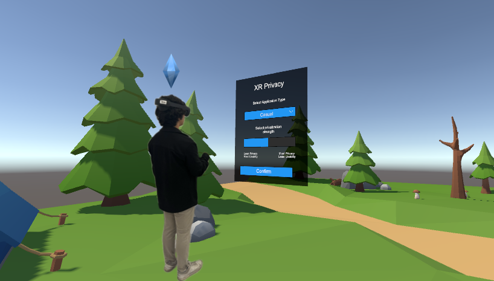
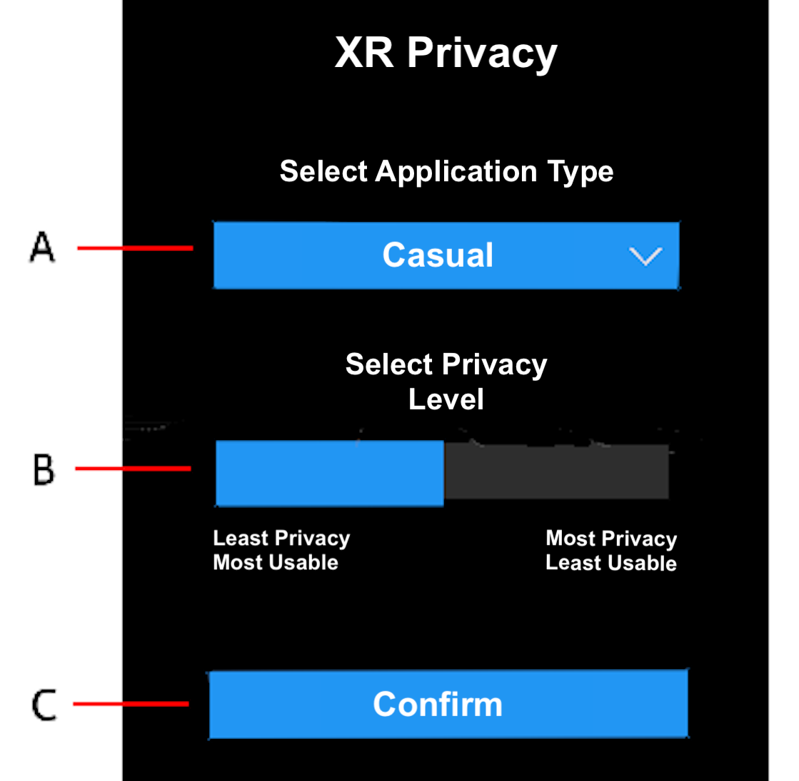

# XR-Privacy SDK
## Toward Practical Privacy in XR - Empirical Analysis of Anonymization Mechanisms against Multimodal Re-Identification Attacks

**Abstract:** As extended reality (XR) systems become increasingly immersive and sensor-rich, they enable the collection of fine-grained behavioral signals such as eye and body telemetry. These signals support personalized and responsive experiences and may also contain unique patterns that can be linked back to individuals. However, privacy mechanisms that naively pair unimodal mechanisms (e.g., independently apply privacy mechanisms for eye and body privatization) are often ineffective at preventing re-identification in practice. In this work, we systematically evaluate real-time privacy mechanisms for XR, both individually and in pair, across eye and body modalities. To preserve usability, all mechanisms were tuned based on empirically grounded thresholds for real-time interaction. We evaluated four eye and ten body  mechanisms across multiple datasets, comprising up to 407 participants.  Our results show that while obfuscating eye telemetry alone offers moderate privacy gains, body telemetry perturbation is substantially more effective. When carefully paired, multimodal mechanisms reduce re-identification rate from 80.3\% to 26.3\% in casual XR applications (e.g., VRChat and Job Simulator) and from 84.8\% to 26.1\% in competitive XR applications (e.g., Beat Saber and Synth Riders), all without violating real-time usability requirements. These findings underscore the potential of modality-specific and context-aware privacy strategies for protecting behavioral data in XR environments.

## GUI of the XR Privacy

  

The GUI features the following features:
- Dropdown menu to select application type (Casual/Competetive)
- Slider to select level of privacy
- "Confirm" butto to confirm selection

After confirmation, selected privacy mechanisms will start working on client side of the application. 

## How to Install
