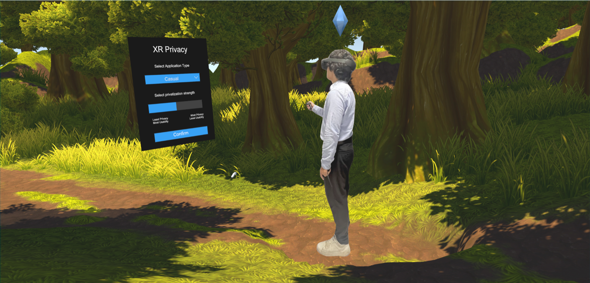
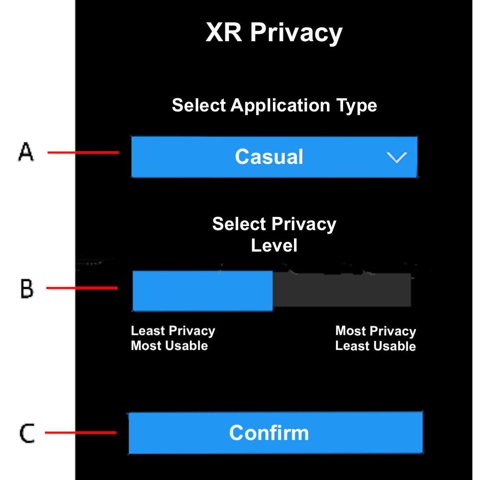

<div align="center">

# XR-Privacy SDK

### Real-time privacy for VR/XR — hide who you are in your motion, keep the experience.

[](https://unity.com/)
[](#-install)
[](https://github.com/azimIbragimov/XR-Privacy-SDK/tags)
[](https://github.com/azimIbragimov/XR-Privacy-SDK/stargazers)
[](https://github.com/azimIbragimov/XR-Privacy-SDK/commits)
[](https://ieeexplore.ieee.org/abstract/document/11457892)
[](https://arxiv.org/abs/2506.13882)

</div>

XR headsets stream your head, hand, and eye movement — and that motion is as unique as a
fingerprint. This SDK perturbs it in real time so users are much harder to re-identify,
without breaking the experience. It's the official implementation of the multimodal
(gaze + body) privatization methods from our paper.

## ✨ Features

| | |
|---|---|
| **Real-time protection** | Hides identifying patterns in body and eye movement while you use the app |
| **Privacy mechanisms** | Gaussian, Spatial, Smoothing, Temporal, MetaGuard, and Deep Motion Masking (DMM) — plus composite combinations |
| **Simple controls** | One strength dial and ready-made **Casual** / **Competitive** presets |
| **One-click setup** | A menu wizard builds and wires the whole scene for you |
| **Recording** | Save the original and privatized motion to a CSV file |


## 🎥 Walkthrough

<div align="center">

[](https://www.youtube.com/watch?v=-eT6piXPrb0)

</div>

## 📦 Install

In Unity (6000.1 or newer): **Window → Package Manager → Add package from git URL…**

```
https://github.com/azimIbragimov/XR-Privacy-SDK.git
```

Everything it needs (the on-device ML runtime and XR Interaction Toolkit) installs
automatically.

## 🚀 Quick start

1. Open a scene.
2. Run **Tools → XR-Privacy → Set Up Scene**.
   - First run: it imports the XR rig, then asks you to run it again.
   - Second run: it builds and wires everything for you.
3. Press **Play**.

No manual setup required.

## 🎮 Using it

<div align="center">
  
</div>

A small panel appears in front of you with three controls:

- **Application Type** — pick **Casual** or **Competitive** (each uses privacy settings
  tuned for that kind of app).
- **Privacy Strength** — slide up for more privacy.
- **Confirm** — turns privacy on (press again to turn it off).

With privacy on, the controllers and gaze are subtly altered so the user is much harder to
re-identify, while the app stays usable. A small red dot shows where the (privatized) gaze
is pointing.

To capture the data, tick **Record Session** on the `XRPrivacyManager` to save a CSV of the
original and privatized motion (the path is printed to the Console).

## 📄 Paper abstract

As extended reality (XR) systems become increasingly immersive and sensor-rich, they enable
the collection of fine-grained behavioral signals such as eye and body telemetry. These
signals support personalized and responsive experiences and may also contain unique patterns
that can be linked back to individuals. However, privacy mechanisms that naively pair
unimodal mechanisms (e.g., independently apply privacy mechanisms for eye and body
privatization) are often ineffective at preventing re-identification in practice. In this
work, we systematically evaluate real-time privacy mechanisms for XR, both individually and
in pair, across eye and body modalities. To preserve usability, all mechanisms were tuned
based on empirically grounded thresholds for real-time interaction. We evaluated four eye and
ten body mechanisms across multiple datasets, comprising up to 407 participants. Our results
show that while obfuscating eye telemetry alone offers moderate privacy gains, body telemetry
perturbation is substantially more effective. When carefully paired, multimodal mechanisms
reduce re-identification rate from **80.3% to 26.3%** in casual XR applications (e.g., VRChat
and Job Simulator) and from **84.8% to 26.1%** in competitive XR applications (e.g., Beat
Saber and Synth Riders), all without violating real-time usability requirements. These
findings underscore the potential of modality-specific and context-aware privacy strategies
for protecting behavioral data in XR environments.

## 📚 Cite

If you use this SDK in your research, please cite the following papers:

> A. Ibragimov, E. Wilson, K. R. B. Butler and E. Jain, "Toward Multimodal Privacy in XR:
> Design and Evaluation of Composite Privatization Methods for Gaze and Body Tracking Data,"
> in *IEEE Transactions on Visualization and Computer Graphics*, vol. 32, no. 5,
> pp. 4396-4407, May 2026, doi: [10.1109/TVCG.2026.3679093](https://doi.org/10.1109/TVCG.2026.3679093).

> Vivek C Nair, Gonzalo Munilla-Garrido, and Dawn Song. 2023. Going Incognito in the Metaverse:
> Achieving Theoretically Optimal Privacy-Usability Tradeoffs in VR. In *Proceedings of the
> 36th Annual ACM Symposium on User Interface Software and Technology (UIST '23)*. Association
> for Computing Machinery, New York, NY, USA, Article 61, 1–16.
> https://doi.org/10.1145/3586183.3606754

> V. Nair, W. Guo, J. F. O'Brien, L. Rosenberg and D. Song, "Deep Motion Masking for Secure,
> Usable, and Scalable Real-Time Anonymization of Ecological Virtual Reality Motion Data," *2024
> IEEE Conference on Virtual Reality and 3D User Interfaces Abstracts and Workshops (VRW)*,
> Orlando, FL, USA, 2024, pp. 493-500, doi: [10.1109/VRW62533.2024.00096](https://doi.org/10.1109/VRW62533.2024.00096).

> E. Wilson, A. Ibragimov, M. J. Proulx, S. D. Tetali, K. Butler and E. Jain,
> "Privacy-Preserving Gaze Data Streaming in Immersive Interactive Virtual Reality: Robustness
> and User Experience," in *IEEE Transactions on Visualization and Computer Graphics*, vol. 30,
> no. 5, pp. 2257-2268, May 2024, doi: [10.1109/TVCG.2024.3372032](https://doi.org/10.1109/TVCG.2024.3372032).
